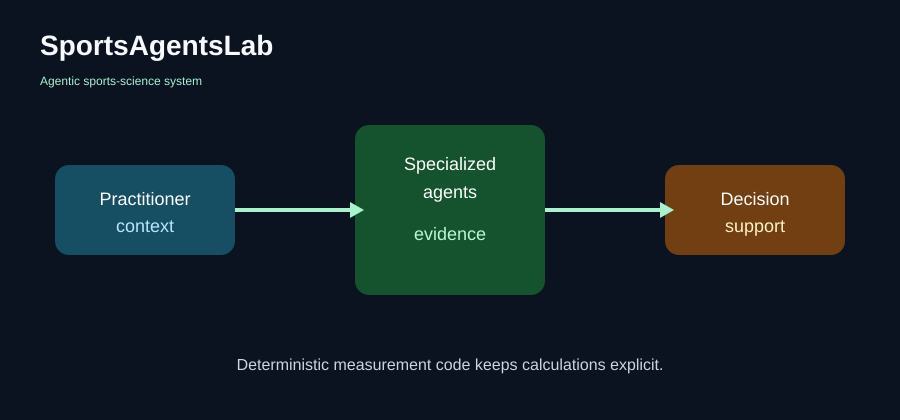

# SportsAgentsLab

## Public source-available technical snapshot

SportsAgentsLab is an agentic sports-science system for measurement, research,
monitoring, and training decision support.



This repository is a curated technical snapshot of a privately developed
system. It is public for inspection, demonstration, professional evaluation,
and research discussion. It is proprietary and not open source; see [LICENSE](LICENSE).

## What SportsAgentsLab is

Specialized agents operate within defined scientific and operational domains.
Deterministic software produces numerical measurements. AI interaction can
organize context, summarize evidence, and make uncertainty visible, but it is
not the measurement calculator or the practitioner.

Practitioners retain authority over consequential decisions.

## The agent system

| Agent | Question | Public example |
| --- | --- | --- |
| Measurement Agent | What was measured? | Synthetic force-platform CMJ walkthrough |
| Research Agent | What does the evidence establish? | Structured synthetic summary |
| Monitoring Agent | How is it changing over time? | Synthetic longitudinal snapshot |
| Prescription Agent | What training options fit the context? | Illustrative decision-support card |
| Marketing Agent | How is an approved capability communicated? | Separate communication example |

The Marketing Agent is intentionally outside the measurement and research
evidence chain.

## Scientific computation and AI

The public scientific slice uses explicit seconds, newtons, kilograms, finite
values, monotonic time, and a deterministic trapezoidal integral. The
countermovement jump example uses a declared synthetic interval so the reader
can inspect the arithmetic. It does not expose hidden event rules, private
device mappings, or confidential evaluation material.

The key separation is simple:

```text
AI interaction → context, explanation, uncertainty
deterministic code → validation, units, calculation
practitioner → interpretation and decision authority
```

## Current technical snapshot

- `REAL_PRODUCTION_DERIVED`: selected typed boundary interfaces, a small unit
  contract, and presentational panel primitives.
- `PUBLIC_ADAPTER`: public role and result interfaces with no service runtime.
- `PUBLIC_DEMO_ONLY`: the offline showcase web app.
- `SYNTHETIC_DATA_ONLY`: generated force traces, plots, and agent cards.
- `INTERFACE_ONLY`: typed shapes that do not imply a production implementation.

The production codebase remains private and authoritative. No backend,
service credential, athlete record, or customer integration is required.

## Measurement Agent case study

Read [the force-platform CMJ case study](docs/case-studies/force-platform-cmj.md)
and run:

```text
python examples/cmj/run_demo.py
```

The demo writes a canonical synthetic trace and prints a bounded summary. The
render-only plot is available at
`assets/plots/cmj-force-time.svg` and the visual previews are under
`assets/screenshots/`.

## Codebase tour

- `apps/showcase-web/` — static, responsive, accessible showcase app.
- `packages/public-science/` — deterministic synthetic force-time example.
- `packages/public-domain/` — small public observation and evidence models.
- `packages/public-agent-interfaces/` — typed public boundary examples.
- `packages/public-ui/` — selected presentational panel primitives.
- `examples/` — runnable offline demonstrations.
- `docs/` — system, agent, scientific, validation, and safety explanations.
- `assets/` — diagrams, plots, screenshots, and a hash manifest.

## Validation philosophy

Tests exercise normal inputs and failure boundaries. The public repository
keeps construction truth, derived values, review notes, and limitations
distinct. It does not include confidential evaluation partitions or hidden
reference outputs.

## Demo

Open `apps/showcase-web/index.html` in a browser or serve the repository with
any static file server. The app is offline, needs no model key, and uses
synthetic values only.

## Repository scope and rights

This is a source-available proprietary snapshot, not an open-source project.
The private product remains the authority. Public visibility does not grant
permission to reuse, modify, redistribute, commercialize, train models on, or
build competing products from the materials. See [LICENSE](LICENSE),
[SECURITY.md](SECURITY.md), and [TRADEMARKS.md](TRADEMARKS.md).

## Status

Available, in development, research, and planned capabilities are separated in
[the capability document](docs/capabilities.md). Roadmap items are exploratory
and do not promise compatibility or availability.
